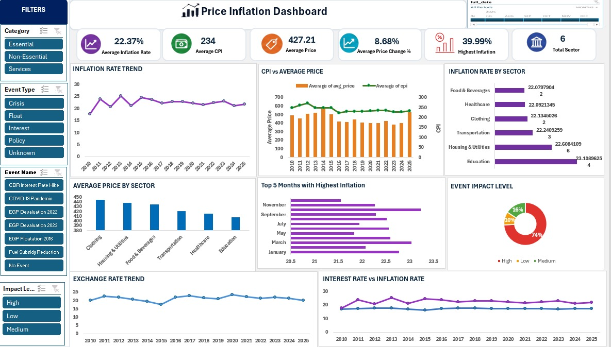

# 📊 Excel Dashboard

This folder contains the interactive Excel dashboard developed for the Egypt Inflation Analysis project.

---

## Dashboard Features

- KPI Cards
- Pivot Tables
- Pivot Charts
- Interactive Slicers
- Monthly Inflation Analysis
- Category Comparison
- Trend Analysis

---

## Dashboard Preview

### Overview

---

## Key Insights

Education recorded the highest inflation rate among all sectors at 23.11%, while all other sectors remained closely clustered between 22% and 23%.

Economic events categorized as having a High Impact heavily dominate the data, accounting for 74% of the recorded impact levels.

Average Price and CPI are highly synchronized, showing a strong parallel trend line over the years.

The overall Average Inflation Rate sits at 22.37%, supported by relatively stable historical trends in both exchange rates and interest rates.

November and September stand out as the top months experiencing the highest inflation rates.
